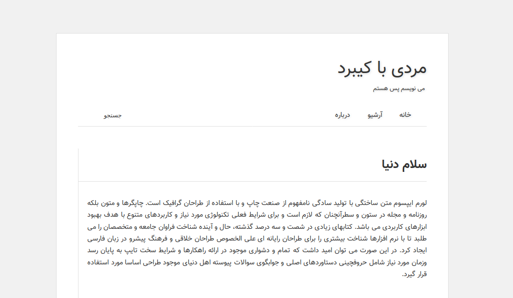

[Forked](https://github.com/geekrainy/hexo-theme-purely)
# purely-rtl

- RTL
- Font Vazir
- Persian language



### Install:
1- clone repo


```shell
	gti clone https://github.com/1W3/purely-rtl.git theme/purely-rtl
```

2- Edit _config.yml :
```yml
	theme: purely
```

[Demo](1w3.github.io)
